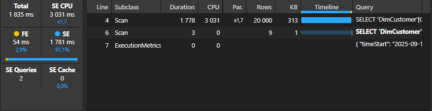
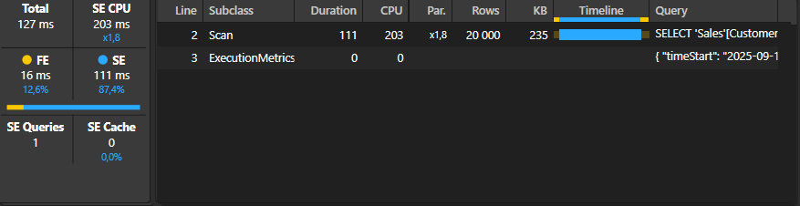

# Case [001] – [customers-10plus-orders]

## Measure description 
Count the number of customers who have placed **10 or more sales transactions**, based on the `Sales` table with 5m+ rows. 


---

## Performance optimazation 
In the original version, each customer is evaluated using CALCULATE(DISTINCTCOUNT()), which causes expensive row context transitions between the DimCustomer and Sales table.
Switching to SUMMARIZECOLUMNS and COUNTROWS on the Sales table eliminated context transitions and cut execution time.


### Old measure 



### Optimized measure 

---

## Original DAX measure 

```dax

Customers 10+ orders = 
COUNTROWS (
    FILTER (
        VALUES ( DimCustomer[CustomerID] ),
        CALCULATE (
            DISTINCTCOUNT ( Sales[SalesID] )
        ) >= 10
    )
)

```

## Optimized DAX measure 

```dax 
Optimized  = 
VAR vtable = SUMMARIZECOLUMNS(
				Sales[CustomerID],
				"sales10+", CALCULATE(COUNTROWS(Sales)))

VAR filtered = FILTER(vtable,[sales10+] >= 10 )

VAR result = COUNTROWS (vtable)
RETURN result

```

## Original DAX query 

```dax 

// DAX Query
DEFINE
	VAR __DS0Core = 
		SUMMARIZECOLUMNS(
			ROLLUPADDISSUBTOTAL('DimCustomer'[Country], "IsGrandTotalRowTotal"),
			"Customers_10__orders", 'DAXmeasures'[Customers 10+ orders]
		)

	VAR __DS0PrimaryWindowed = 
		TOPN(502, __DS0Core, [IsGrandTotalRowTotal], 0, 'DimCustomer'[Country], 1)

EVALUATE
	__DS0PrimaryWindowed

ORDER BY
	[IsGrandTotalRowTotal] DESC, 'DimCustomer'[Country]

```